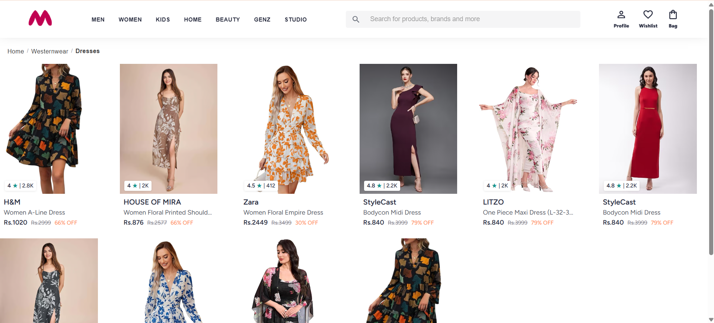
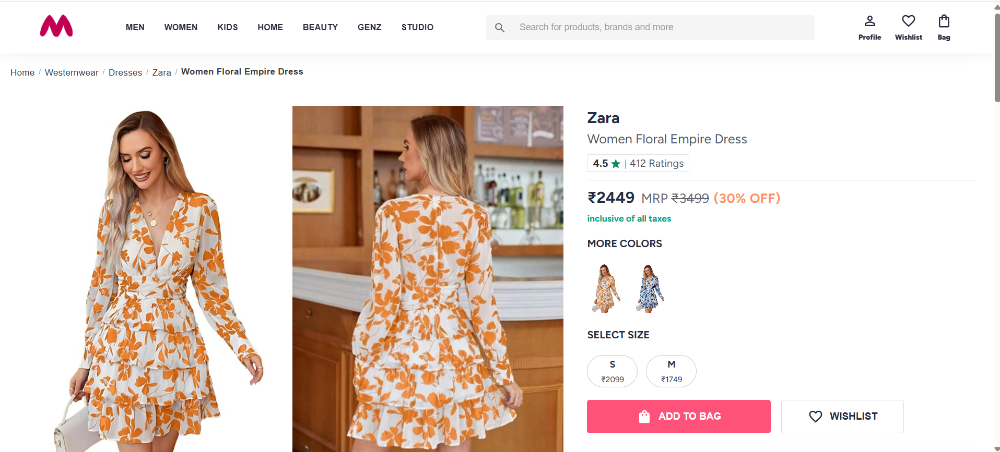
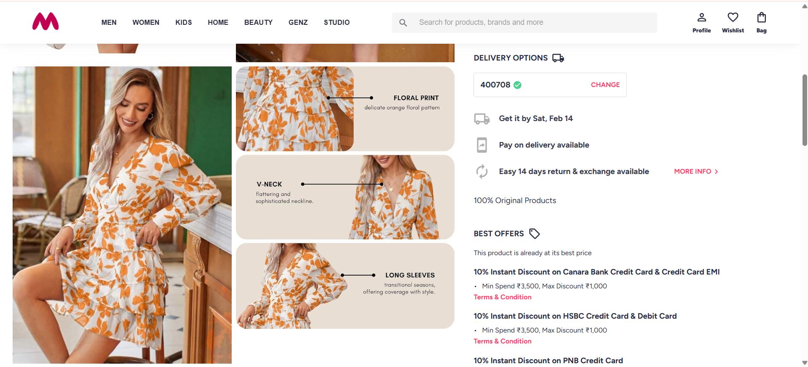
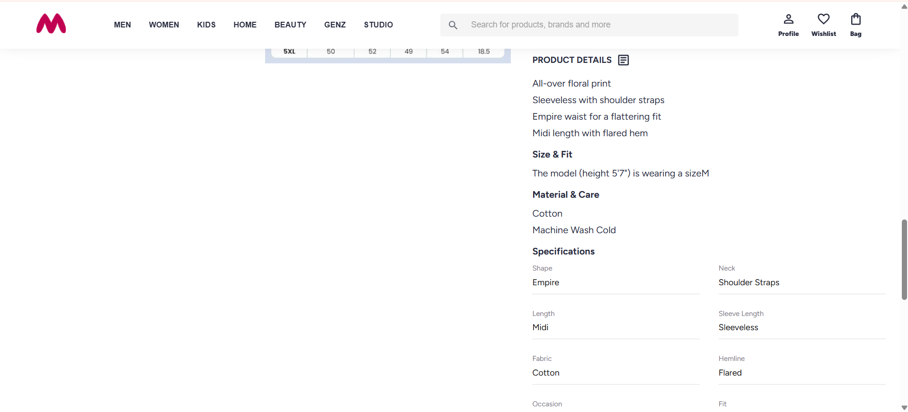
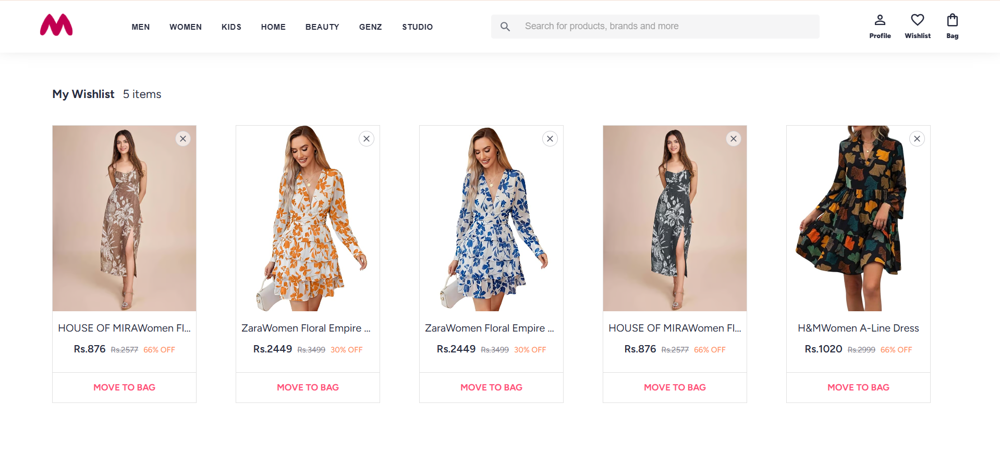

# Myntra UI Clone (In Progress)

A scalable e-commerce frontend inspired by Myntra, built using React with a strong focus on clean architecture, reusable components, and maintainable styling systems.

This project emphasizes real-world frontend engineering practices over simple UI replication.

---

## Tech Stack

- React (Functional Components + Hooks)
- JavaScript (ES6+)
- SCSS (Modular & Scalable Architecture)
- Vite

---

## Engineering Focus

This project follows an architecture-first approach:

- Modular and scalable folder structure
- Global SCSS architecture with tokens, mixins, and structured styling layers
- Clean component abstraction and reusability
- Separation of concerns (UI, layout, styles)
- Future-ready project organization

---

## Current Features

- Navigation bar
- Product listing grid
- Product overview pages
- Reusable UI components
- Structured SCSS architecture
- Scalable styling system

_More features are actively being developed._

---

## Folder Structure Philosophy

The folder structure is designed to support long-term scalability and feature expansion, following real-world frontend architecture patterns rather than flat project organization.

---

## Screenshots








---

## Run Locally

```bash
git clone https://github.com/swati1547/myntra-ui-clone
cd myntra-ui-clone
npm install
npm run dev
```

---

## Project Status

🚧 Actively in progress
Enhancements and architectural refinements are continuously being added.

---

## Author

Swati Garje
React Developer focused on scalable frontend architecture

GitHub: https://github.com/swati1547
